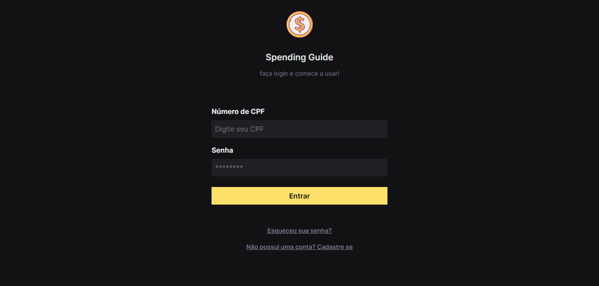
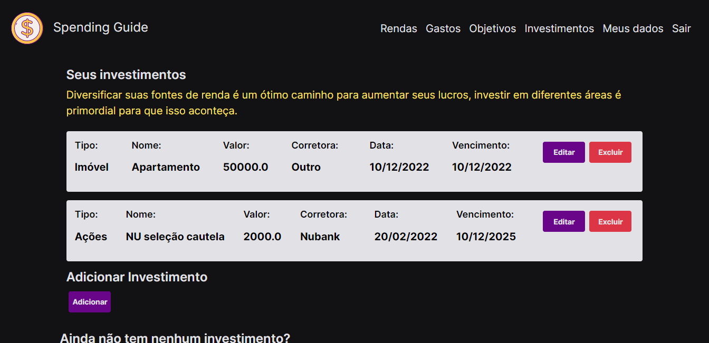

<h1 align="center"> Fintech </h1>

Projeto full stack desenvolvido durante o curso de Análise e desenvolvimento de sistemas.

  <a href="#-tecnologias">Tecnologias</a>&nbsp;&nbsp;&nbsp;|&nbsp;&nbsp;&nbsp;
  <a href="#-projeto">Projeto</a>&nbsp;&nbsp;&nbsp;|&nbsp;&nbsp;&nbsp;
  

 

  
  

## 🚀 Tecnologias

Esse projeto foi desenvolvido com as seguintes tecnologias:

- HTML e CSS
- JavaScript
- Java

## 💻 Projeto

O projeto foi desenvolvido inteiramente por mim desde o conceito do desing e protótipo no figma ao banco de dados (Oracle) e controllers em Java. Nele é possível realizar cadastro/login e adicionar, bem como, aconpanhar aspectos de sua vida financeira como gastos, rendas, investimentos e objetivos além de permitir excluir e atualizar os mesmos.

Feito com ♥ 
